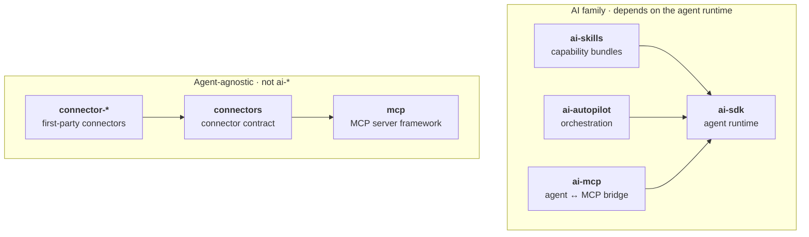

# 💎 GemStack

A collection of high-quality, framework-agnostic tools for building AI applications in Node.

GemStack is shared, community-governed infrastructure built with the [Vike](https://vike.dev) team. Each tool is a standalone, well-tested package that works in any Node app and composes cleanly with the others. Packages join GemStack by *graduating* one at a time, when they prove framework-agnostic value, not by bulk-moving a framework's package set in.

## Packages

All packages publish under the **`@gemstack/`** scope (e.g. `npm install @gemstack/ai-sdk`).

Full documentation lives in [`docs/`](./docs/guide/index.md) (a hosted site is on the way): a [guide](./docs/guide/index.md), a [getting-started walkthrough](./docs/guide/first-agent.md), and a deep guide per package (linked in the **Docs** column below).

<!-- Package-name cells use a non-breaking hyphen (U+2011) so names like `ai-autopilot` do not wrap mid-name in GitHub's table. The real install names (normal hyphens) are in the scope line above and each package's README. -->

| Package | Description | Docs | Version |
|---|---|---|---|
| [`ai‑sdk`](./packages/ai-sdk) | The agent runtime: providers, the agent loop, tools, streaming, middleware, structured output, memory, and evals. The engine the rest of the AI family builds on. | [Guide](./docs/packages/ai-sdk/index.md) | [](https://www.npmjs.com/package/@gemstack/ai-sdk) |
| [`ai‑skills`](./packages/ai-skills) | Portable capability bundles: load `SKILL.md` skills (instructions + tools + resources) and compose them onto an agent on demand. | [Guide](./docs/packages/ai-skills.md) | [](https://www.npmjs.com/package/@gemstack/ai-skills) |
| [`ai‑autopilot`](./packages/ai-autopilot) | The AI‑building framework: a Supervisor (plan → dispatch → synthesize) plus stack‑aware personas, a runner sandbox, surfaces, a decisions ledger, an event‑triggered review/QA loop with a built‑in prompt library, framework presets (Vike/Next), and a bootstrap flow that takes an app from nothing to production‑grade. | [Guide](./docs/packages/ai-autopilot.md) | [](https://www.npmjs.com/package/@gemstack/ai-autopilot) |
| [`ai‑mcp`](./packages/ai-mcp) | The agent/MCP bridge: consume a remote MCP server's tools as agent tools, and expose an agent as an MCP server. | [Guide](./docs/packages/ai-mcp.md) | [](https://www.npmjs.com/package/@gemstack/ai-mcp) |
| [`mcp`](./packages/mcp) | A standalone framework for *authoring* MCP servers: tools, resources, prompts, decorators, OAuth 2.1, a framework-neutral HTTP handler, and a test client. Agent-agnostic. | [Guide](./docs/packages/mcp.md) | [](https://www.npmjs.com/package/@gemstack/mcp) |
| [`connectors`](./packages/connectors) | The connector contract: define a tool connector to an external service once with `defineConnector`, and compose any number into a single MCP server with `mountConnectors`. Built on `@gemstack/mcp`; agent-agnostic. | [Guide](./docs/packages/connectors.md) | [](https://www.npmjs.com/package/@gemstack/connectors) |
| [`connector‑github`](./packages/connector-github) | First-party connector: read and act on GitHub issues, pull requests, and repo files. | [Guide](./docs/packages/connector-github.md) | [](https://www.npmjs.com/package/@gemstack/connector-github) |
| [`connector‑google‑drive`](./packages/connector-google-drive) | First-party connector: browse, read, and share Google Drive files. | [Guide](./docs/packages/connector-google-drive.md) | [](https://www.npmjs.com/package/@gemstack/connector-google-drive) |

### How they fit together

Two independent stacks. Arrows point to what a package depends on; nothing points "up."



The `ai-` prefix means **"depends on the agent runtime."** `skills`, `autopilot`, and `ai-mcp` all depend on `ai-sdk`, which depends on none of them. A package about AI that is agent-agnostic (like `@gemstack/mcp`) is a peer of the family, not a member of it.

### Connectors

`@gemstack/connectors` is the contract for wiring external services (GitHub, Google Drive, ...) into an agent as MCP tools. A connector declares its auth needs and its tools with `defineConnector`; the orchestrator supplies credentials and composes any number of them into one server with `mountConnectors`. First-party connectors ship as `@gemstack/connector-*`, and third parties publish their own `connector-*` against the same contract.

See [`Architecture.md`](./Architecture.md) for the full layering, naming rule, and graduation policy.

### Which MCP package do I use?

The two MCP packages point in opposite directions, so they are never duplicates:

> **Exposing an existing agent?** Use [`@gemstack/ai-mcp`](./packages/ai-mcp). It makes an agent speak MCP, or feeds remote MCP tools into one.
>
> **Authoring a server from scratch** (tools / resources / prompts / auth)? Use [`@gemstack/mcp`](./packages/mcp). A full server framework, with no agent involved.

## Development

```bash
pnpm install
pnpm build        # build all packages (Turborepo)
pnpm dev          # watch mode
pnpm typecheck
pnpm test
```

This is a pnpm + Turborepo + Changesets monorepo. Runnable examples live under [`examples/`](./examples) — e.g. [`mcp-quickstart`](./examples/mcp-quickstart), [`autopilot-quickstart`](./examples/autopilot-quickstart) (personas + Supervisor + runner + surfaces), and [`bootstrap-quickstart`](./examples/bootstrap-quickstart) (the whole bootstrap flow, offline). See [`.changeset/README.md`](./.changeset/README.md) for the release flow.

## Origin

The AI family was spun out of Rudder's mature `@rudderjs/ai` (v1.17.x) and re-versioned under the GemStack umbrella; `@gemstack/mcp` is the graduation of `@rudderjs/mcp`. The old `@rudderjs/*` names live on as the **Rudder bindings** over these engines: they re-export the agnostic core and add the framework-specific pieces that cannot graduate (e.g. `@rudderjs/ai`'s `AiProvider`, ORM-backed stores, doctor check, and `make:agent` / `ai:eval` CLI).

## Governance

GemStack is co-governed (shared npm `@gemstack` org + `gemstack-land` GitHub org). New tools join by mutual agreement; publish rights and 2FA are shared per the governance note.

## License

[MIT](./LICENSE)
