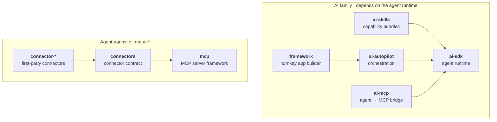

### The Framework

**Autonomous AI programming.**  
Stop babysitting your coding agents. You make the important decisions; AI does the rest.

[](https://www.npmjs.com/package/@gemstack/framework) [](./LICENSE) [](https://discord.gg/qc8zvdzWNR)

<br clear="left" />

The Framework turns your coding agent into an autonomous teammate: it plans, researches, implements, reviews, and improves its own work, while keeping you in control of the decisions that matter. It wraps a coding-agent CLI (Claude Code today) as a black box and takes you from an idea to a running app, with a localhost dashboard that shows the orchestration the agent's own chat cannot: the loop status, the review passes, and the queue of what is next.

It is 100% open source, runs 100% locally, and uses your existing AI subscription (bring your own Claude Code).

## Quickstart

```bash
npm i -g @gemstack/framework
framework "a paginated orders page backed by an orders table, with sign-in"

# one-shot, no install:
npx @gemstack/framework "..."

# deterministic offline demo (no model, no API key):
framework --fake
```

## Stop babysitting

AI is capable, yet left alone it is lazy, forgetful, and quietly makes decisions it should be asking you about. The Framework fixes that at the prompt layer:

- **AI is lazy.** It splits large tasks into subtasks and works through a checklist, so it spends real effort instead of taking shortcuts.
- **AI plans lazily.** A loop of critical feedback and research runs before any code is written.
- **AI writes throwaway code.** It questions and reviews its own work until it is confident the result is correct, maintainable, and DRY.
- **AI decides without asking.** When real alternatives with trade-offs exist, it surfaces them to you instead of silently picking one.
- **AI forgets.** Decisions and context are saved to `knowledge-base/*.md` in your repo, so you stop repeating yourself.

## How it works

The Framework does not run its own agent. It drives a coding agent as a black box: it sends a prompt, lets the agent's own loop run, reads the code produced, gates on the outcome (builds, serves, review passes), then re-prompts. The seam is the code, never the agent's individual tool calls, so the wrapped agent keeps its subscription-based auth and stays swappable.

- **Enhanced system prompt.** Best-practice instructions layered on top of your agent: divide and conquer, enumerate before coding, self-review, surface alternatives. Fully customizable, or opt out.
- **Autopilot.** Pick how much runs unattended. Quick wins and quality refactors can run on their own; non-obvious decisions still come back to you.
- **Dashboard.** A localhost dashboard shows the live run, the loop status, the review passes, the queue of upcoming tasks, the reviews waiting on you, and your subscription usage.
- **Bring your own subscription.** Orchestrates agents through your existing Claude Code install, so there is no extra API bill.
- **100% local.** Runs on your machine like a desktop app. No backdoors, no tracking; your knowledge base lives as `knowledge-base/*.md` in your own Git repository.

See the [`@gemstack/framework` README](./packages/framework/README.md) for the CLI, the library API, and the driver seam.

## Built on GemStack

The Framework is the turnkey product on top of **GemStack**: a collection of high-quality, framework-agnostic packages built with the [Vike](https://vike.dev) team. Each package is standalone, well tested, and works in any Node app; The Framework composes them into one product. Packages join GemStack by *graduating* one at a time, when they prove framework-agnostic value, not by bulk-moving a framework's package set in.

All packages publish under the **`@gemstack/`** scope (e.g. `npm install @gemstack/ai-sdk`).

Full documentation lives in [`docs/`](./docs/guide/index.md) (a hosted site is on the way): a [guide](./docs/guide/index.md), a [getting-started walkthrough](./docs/guide/first-agent.md), and a deep guide per package (linked in the **Docs** column below).

<!-- Package-name cells use a non-breaking hyphen (U+2011) so names like `ai-autopilot` do not wrap mid-name in GitHub's table. The real install names (normal hyphens) are in the scope line above and each package's README. -->

| Package | Description | Docs | Version |
|---|---|---|---|
| [`ai‑sdk`](./packages/ai-sdk) | The agent runtime: providers, the agent loop, tools, streaming, middleware, structured output, memory, and evals. The engine the rest of the AI family builds on. | [Guide](./docs/packages/ai-sdk/index.md) | [](https://www.npmjs.com/package/@gemstack/ai-sdk) |
| [`ai‑skills`](./packages/ai-skills) | Portable capability bundles: load `SKILL.md` skills (instructions + tools + resources) and compose them onto an agent on demand. | [Guide](./docs/packages/ai-skills.md) | [](https://www.npmjs.com/package/@gemstack/ai-skills) |
| [`ai‑autopilot`](./packages/ai-autopilot) | The AI‑building framework: a Supervisor (plan → dispatch → synthesize) plus a runner sandbox, surfaces, an event‑triggered review/QA loop with a built‑in prompt library, framework presets (Vike/Next), and a bootstrap flow that takes an app from nothing to production‑grade. | [Guide](./docs/packages/ai-autopilot.md) | [](https://www.npmjs.com/package/@gemstack/ai-autopilot) |
| [`framework`](./packages/framework) | **The (AI) Framework**: turnkey, zero‑config orchestration built on `ai-autopilot`. Wraps a coding‑agent CLI (Claude Code) as a black box and takes an idea to a running app, with a live dashboard, Open Loop domain presets, an optional Docker sandbox, and a run relay for shared sessions. | [README](./packages/framework/README.md) | [](https://www.npmjs.com/package/@gemstack/framework) |
| [`ai‑mcp`](./packages/ai-mcp) | The agent/MCP bridge: consume a remote MCP server's tools as agent tools, and expose an agent as an MCP server. | [Guide](./docs/packages/ai-mcp.md) | [](https://www.npmjs.com/package/@gemstack/ai-mcp) |
| [`mcp`](./packages/mcp) | A standalone framework for *authoring* MCP servers: tools, resources, prompts, decorators, OAuth 2.1, a framework-neutral HTTP handler, and a test client. Agent-agnostic. | [Guide](./docs/packages/mcp.md) | [](https://www.npmjs.com/package/@gemstack/mcp) |
| [`mcp‑connectors`](./packages/mcp-connectors) | The connector contract: define a tool connector to an external service once with `defineConnector`, and compose any number into a single MCP server with `mountConnectors`. Built on `@gemstack/mcp`; agent-agnostic. | [Guide](./docs/packages/mcp-connectors.md) | [](https://www.npmjs.com/package/@gemstack/mcp-connectors) |
| [`mcp‑connector‑github`](./packages/mcp-connector-github) | First-party connector: read and act on GitHub issues, pull requests, and repo files. | [Guide](./docs/packages/mcp-connector-github.md) | [](https://www.npmjs.com/package/@gemstack/mcp-connector-github) |
| [`mcp‑connector‑google‑drive`](./packages/mcp-connector-google-drive) | First-party connector: browse, read, and share Google Drive files. | [Guide](./docs/packages/mcp-connector-google-drive.md) | [](https://www.npmjs.com/package/@gemstack/mcp-connector-google-drive) |

### How they fit together

Two independent stacks. Arrows point to what a package depends on; nothing points "up."



The `ai-` prefix means **"depends on the agent runtime."** `skills`, `autopilot`, and `ai-mcp` all depend on `ai-sdk`, which depends on none of them. A package about AI that is agent-agnostic (like `@gemstack/mcp`) is a peer of the family, not a member of it.

### Connectors

`@gemstack/mcp-connectors` is the contract for wiring external services (GitHub, Google Drive, ...) into an agent as MCP tools. A connector declares its auth needs and its tools with `defineConnector`; the orchestrator supplies credentials and composes any number of them into one server with `mountConnectors`. First-party connectors ship as `@gemstack/mcp-connector-*`, and third parties publish their own `mcp-connector-*` against the same contract.

See [`Architecture.md`](./Architecture.md) for the full layering, naming rule, and graduation policy.

### Which MCP package do I use?

The two MCP packages point in opposite directions, so they are never duplicates:

> **Exposing an existing agent?** Use [`@gemstack/ai-mcp`](./packages/ai-mcp). It makes an agent speak MCP, or feeds remote MCP tools into one.
>
> **Authoring a server from scratch** (tools / resources / prompts / auth)? Use [`@gemstack/mcp`](./packages/mcp). A full server framework, with no agent involved.

## Development

```bash
pnpm install
pnpm build        # build all packages (Turborepo)
pnpm dev          # watch mode
pnpm typecheck
pnpm test
```

Working on `@gemstack/framework`, run `pnpm build` first: the framework tests need the dashboard bundle. Without `packages/framework-dashboard/dist/client`, the daemon answers `/_telefunc` with a 503 text body and `daemon.test.ts` fails on `JSON.parse` (`SyntaxError: Unexpected token 'h'`), which reads like a real regression but is a missing build step.

This is a pnpm + Turborepo + Changesets monorepo. Runnable examples live under [`examples/`](./examples) — e.g. [`mcp-quickstart`](./examples/mcp-quickstart), [`autopilot-quickstart`](./examples/autopilot-quickstart) (Supervisor + runner + surfaces), and [`bootstrap-quickstart`](./examples/bootstrap-quickstart) (the whole bootstrap flow, offline). See [`.changeset/README.md`](./.changeset/README.md) for the release flow.

## Origin

The AI family was spun out of Rudder's mature `@rudderjs/ai` (v1.17.x) and re-versioned under the GemStack umbrella; `@gemstack/mcp` is the graduation of `@rudderjs/mcp`. The old `@rudderjs/*` names live on as the **Rudder bindings** over these engines: they re-export the agnostic core and add the framework-specific pieces that cannot graduate (e.g. `@rudderjs/ai`'s `AiProvider`, ORM-backed stores, doctor check, and `make:agent` / `ai:eval` CLI).

## Governance

GemStack is co-governed (shared npm `@gemstack` org + `gemstack-land` GitHub org). New tools join by mutual agreement; publish rights and 2FA are shared per the governance note.

## License

[MIT](./LICENSE)
